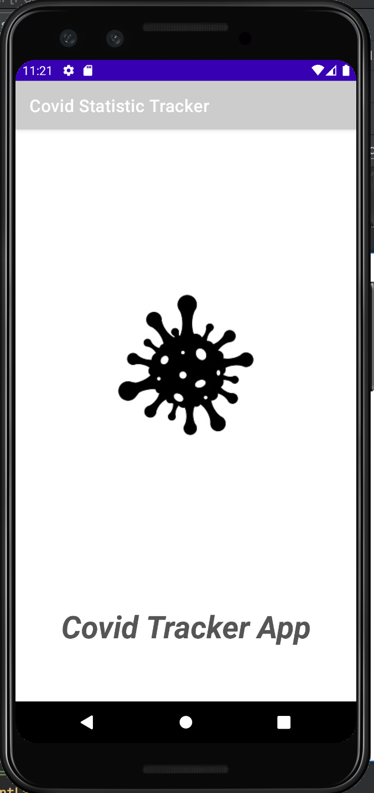

# Elevator Pitch:
### Stay cautious, stay informed! Keep up to date with your local daily Covid Statistics!

# App Title:
### Covid Data Tracker App

# App Description:
An app that communicates with a free, covid tracker API (https://api.covidtracking.com/). This API allows us to track the progress of covid across the United States and gives us important information such as death rates and positive rates. The main purpose of this app is to help visualize this. 

A user can check current covid data for any state they choose by using the select menu at the top. Each state is essentially a new API call to a different endpoint. Using the data retrieved from the selected state, a user can then check to see historical data by date in the Covid History Activity.

### Features:
* Current Covid Positive/Death Rates given by state
* View Daily history of Covid Stats by any given state
* Ability to Update your own Virtual Covid Status
  * Which Vaccine was received
  * Which Dosage
  * When it was received
  * Which Pharmacy
  * Stored In Database!
* Take a picture to celebrate your vaccination!

# App Screenshots:

# Keywords:
Covid, Information, Data, Positive, Negative, Death, Coronavirus, Vaccine, Pfizer, Moderna, Johnson&Johnson, J&J

# Category:
Scientific, News/Information

# See App Demonstration video: 
https://drive.google.com/file/d/1nqHM8ZjjiIOY8DnsmEVHiWRoHQoX7YR7/view?usp=sharing

## Authors

* **Sean Mullarkey** 
